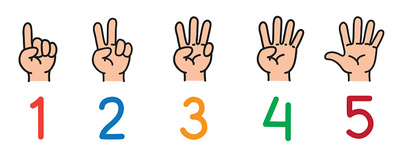

# Finger Counter

Here i create Finger Counter with the help of opencv and handtracking module with mediapipe.

  

# How to run app 

 * You can write this code on any text editor.
 * This is simply python script so by giving proper path of module you can run it.
 * Run the main.py file by doing..
 * `python main.py`
 
## What it looks like

  

