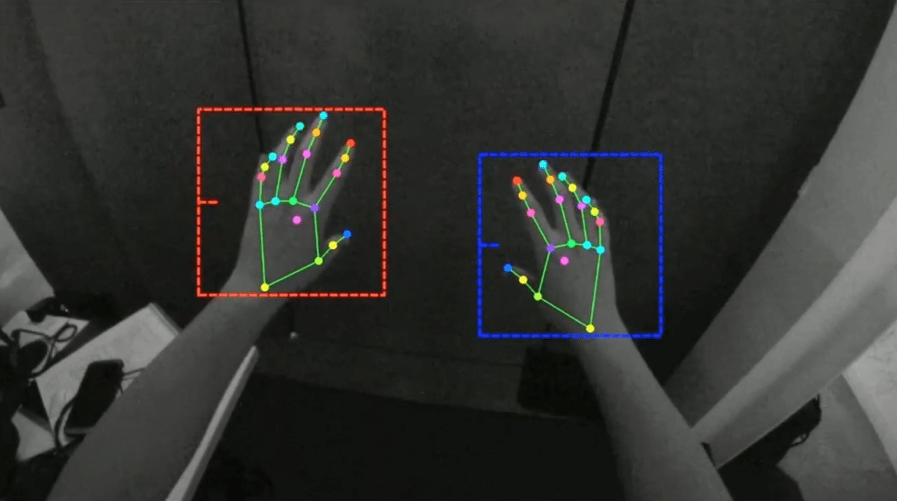

# Hand Tracker

Here i create Hand Tracker module which later will use to create different types of thing.
This module is build using mediapipe library.

  

# How to run app 

 * You can write this code on any text editor by giving `.py` extension.
 * This is simply python script so by giving proper path of module you can run it.
 * Run the main.py file by doing..
 * `python main.py`
 
## What it looks like

  

