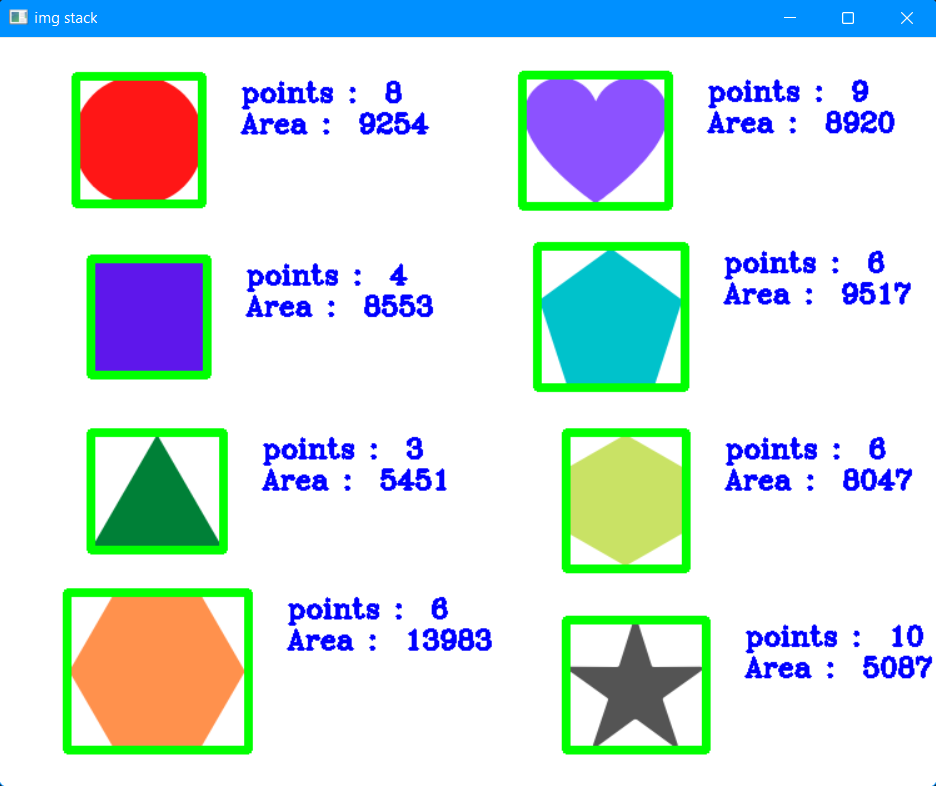

# Shape Detection

Here i create Shape detection using opencv where by giving any static image of live video streaming it detect the shape and it's dimensions.
This project is also used as module to build different things like traffic sign detection.

# How to run app 

 * You can write this code on any text editor.
 * This is simply python script so by giving proper path of module you can run it.
 * Run the main.py file by doing..
 * `python main.py`
 
## Input static Image Given by program. 

  

 
## Output Generated by Program.

  

